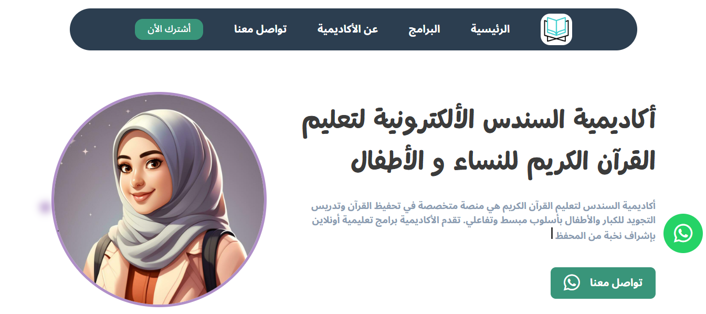
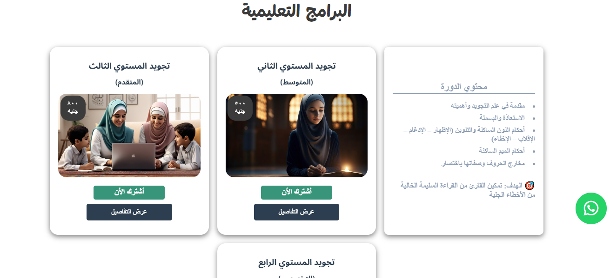
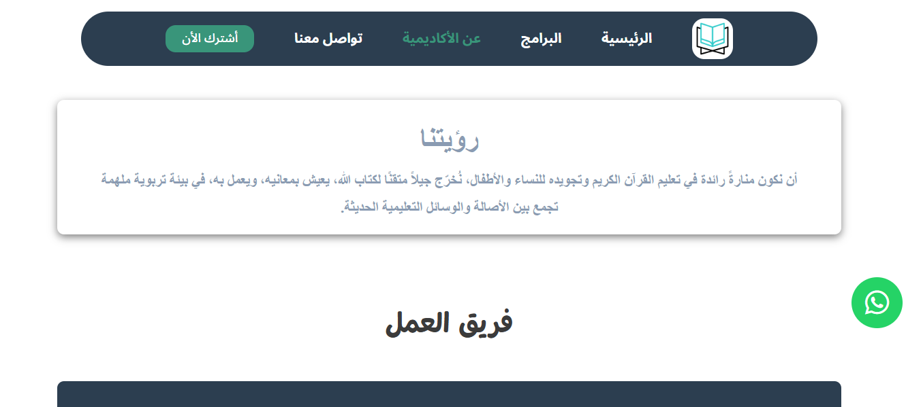
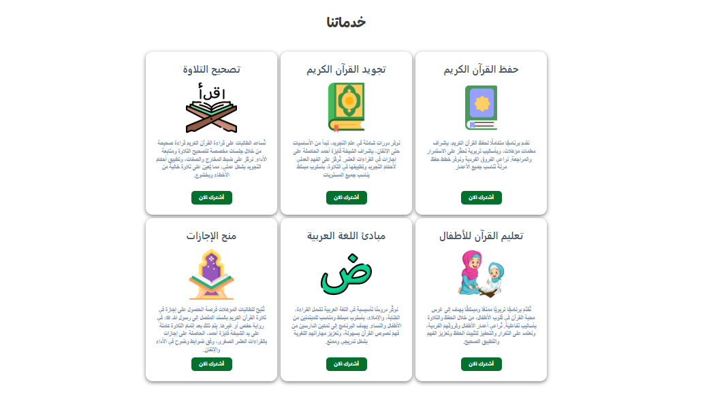
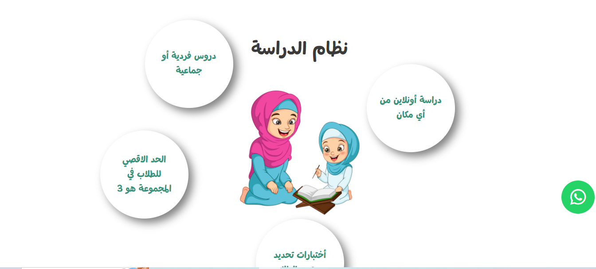

# Creative Agency (Landing Page)
A modern web website
## :clipboard: Project Overview

  
  
  
  
  
  

## :sparkler: Features

  - **:iphone: links :** different icons that navigate to academy what's app
  - **:iphone: flip card :** flip cards to visualize programs and it's details in the other face of the card when user click.
  - **📱Animations : ** nice animation around the image in the hero section and another animation in the studying system section.

## :computer: Technology Stack

  
  
  

live preview:https://mostafa-ashraf0.github.io/Courses_Academy_website/
