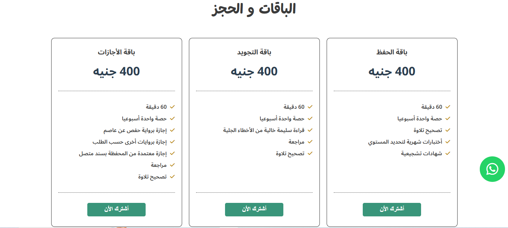

# Creative Agency (Landing Page)
A modern web website
## :clipboard: Project Overview

  
  
  
  
  
  

## :sparkler: Features

  - **:iphone: side menu :** simple side menu that opens when user click on an icon which contain some features like changing the theme color of the website, activate random background option and activate navigation bullets.
  - **:iphone: Navigation bullets :** navigation bullets bar that facilitate the user experience to reach specific section in the site.

## :computer: Technology Stack

  
  
  

live preview:https://mostafa-ashraf0.github.io/Courses_Academy_website/
